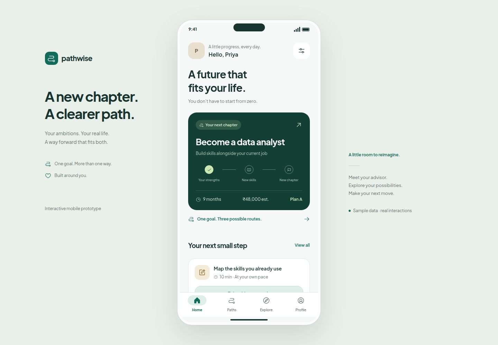

# PATHWISE

A calm, interactive mobile UI prototype for a career pathway advisor. Built with Expo, React Native, TypeScript, and Expo Router for Android, iOS, and a browser preview.



## Open the prototype

Use Node.js 22.13 or newer and npm. From this project directory:

```bash
npm install
npm start
```

Scan the terminal QR code with an Expo Go version compatible with **Expo SDK 57**. Android can scan inside Expo Go; iPhone can use its camera. The computer and phone should be on the same network. If your installed Expo Go does not support SDK 57, consult [Expo's compatibility guidance](https://docs.expo.dev/troubleshooting/expo-go-version-mismatch/).

To open the browser preview:

```bash
npm run web
```

On a phone-sized browser it fills the screen. On a desktop it appears inside a phone presentation frame. The frame is only part of the web preview; the native app uses the full device screen.

No API keys, accounts, database, or backend setup are required. Fonts and the app icon are bundled locally.

## A five-minute walkthrough

1. Choose **Explore my options** for the guided conversation, or **Try the demo** to open Home immediately.
2. Meet **Priya**, a retail operations associate in Kochi exploring a move into data analytics. The starting profile has a ₹60,000 learning budget and eight study hours per week.
3. Compare **Plan A** (part-time data analytics learning), **Plan B** (an adjacent business operations role), and **Plan C** (small reporting projects). Open a route to see milestones, readiness, and tradeoffs.
4. Open **What if my situation changes?** and choose a lower budget. Preview the changed recommendation and costs. **Keep my current plan** discards the draft; **Apply these changes** updates the shared profile and active route.
5. Save an opportunity in **Explore**, view it through the bookmark filter, and complete a task under **Your next small step**.
6. Visit **Profile** to edit goals, strengths, budget, study time, mobility, income priorities, or optional support preferences. **Reset demo** restores the original journey.

## What works

- Full navigation between welcome, advisor, home, profile editing, route comparison and detail, what-if previews, opportunities, and next steps.
- Branching sample conversation: choosing family time asks about study time before budget. Supported typed answers and selectable options update the same profile; unsupported text offers sample choices.
- Voice demonstration with a sample transcript and an explicit “Use this sample answer” action. Camera demonstration without requesting device access.
- Reversible bookmarks, opportunity search and category filters, empty states, task completion, validation messages, and reset confirmation.
- Deterministic scenario changes: budgets below ₹48,000 favor the adjacent route when affordable; earlier earning favors projects; fewer hours extend timelines. If no sample route fits the budget, the UI shows the funding gap instead of claiming a match.
- Three selectable career goals: data analyst, business analyst, and reporting specialist. All routes use remote-compatible learning, so changing mobility updates the preference without inventing a new local listing.
- Labeled controls, keyboard focus styling, optional support questions, reduced-motion handling, and native safe-area/keyboard layouts.

## Prototype boundaries

All people, providers, listings, costs, and timelines are illustrative. The interface labels sample information and does not claim verified opportunities, guaranteed employment, or actual scholarship eligibility. There is no live AI, recording, emotion analysis, application submission, or enrollment.

Changes remain in memory while navigating. Reloading/restarting the app or using Reset demo clears the session. The next-step checklist is an exploratory checklist shared by all three sample routes, not an automatically generated study curriculum.

## Project structure

- `app/` — Expo Router screens and four-tab navigation.
- `src/components/` — shared controls, typography, branching journey artwork, and the desktop preview shell.
- `src/data/model.ts` — sample profiles, pathways, opportunities, and deterministic scenario rules.
- `src/state/DemoContext.tsx` — session state and reversible actions.
- `src/theme.ts` — shared color and typography tokens.
- `tests/` — state-logic tests and complete browser journeys.
- `artifacts/screenshots/` — actual browser captures of the prototype.

Plus Jakarta Sans is bundled under the SIL Open Font License. Icons and the app mark use Phosphor under the MIT license. License copies are in `assets/licenses/`.

## Validation

```bash
npm run typecheck
npm test
npx expo install --check
npm run export:web
npm run export:native -- --output-dir dist-native
```

For browser tests, keep `npm run web -- --port 8081` running in one terminal, then run:

```bash
npm run test:ui
```

The test configuration uses Chrome at `/usr/bin/google-chrome`. Set `PATHWISE_CHROME` to a different installed Chrome/Chromium executable and `PATHWISE_TEST_URL` if using another preview address. Tests exercise supported and unsupported advisor answers, adaptive questions, camera/voice demonstrations, comparison, draft discard/apply, shared state, bookmarks, search, profile validation, reset, keyboard focus, and widths from 320 to 1440 pixels.

See [VALIDATION.md](VALIDATION.md) for results and remaining manual device checks.

### Restricted workspace environment

If the execution environment makes the default npm cache or Expo user directory read-only, use temporary writable locations without changing your home directory:

```bash
npm_config_cache=/tmp/pathwise-npm-cache npm install
__UNSAFE_EXPO_HOME_DIRECTORY=/tmp/pathwise-expo EXPO_NO_TELEMETRY=1 npm run web
```

These shell settings are only for a restricted local environment; they are not required in a normal terminal.
# iqooo
